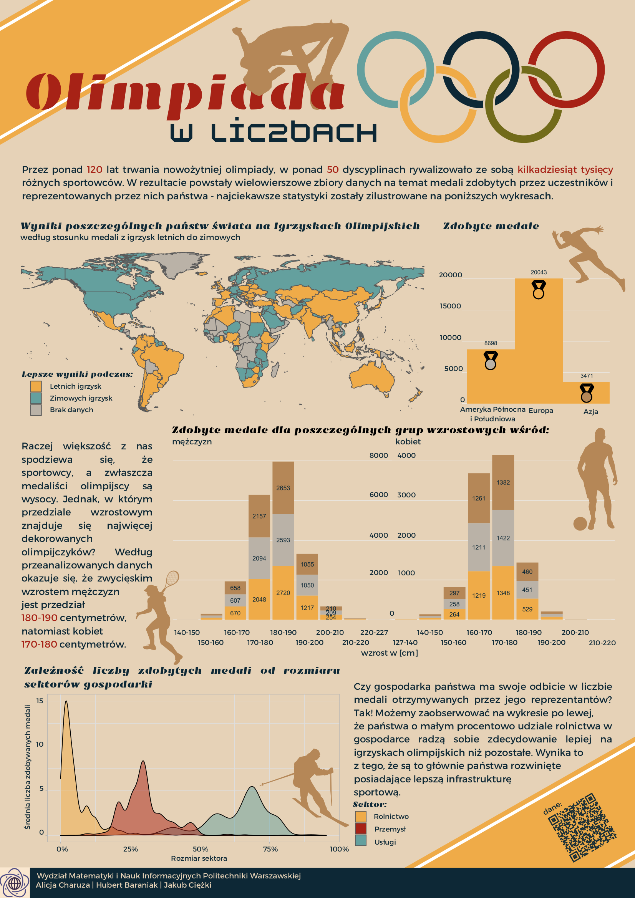
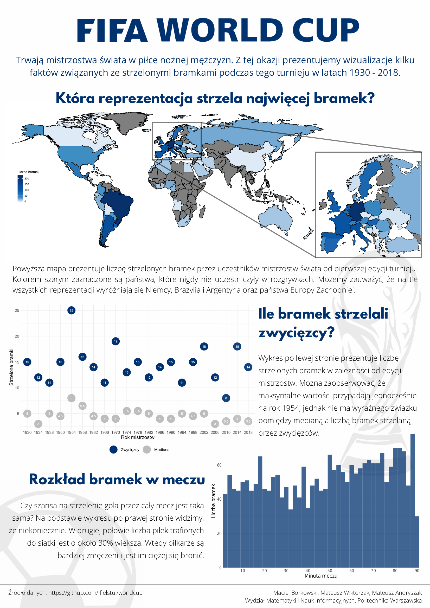
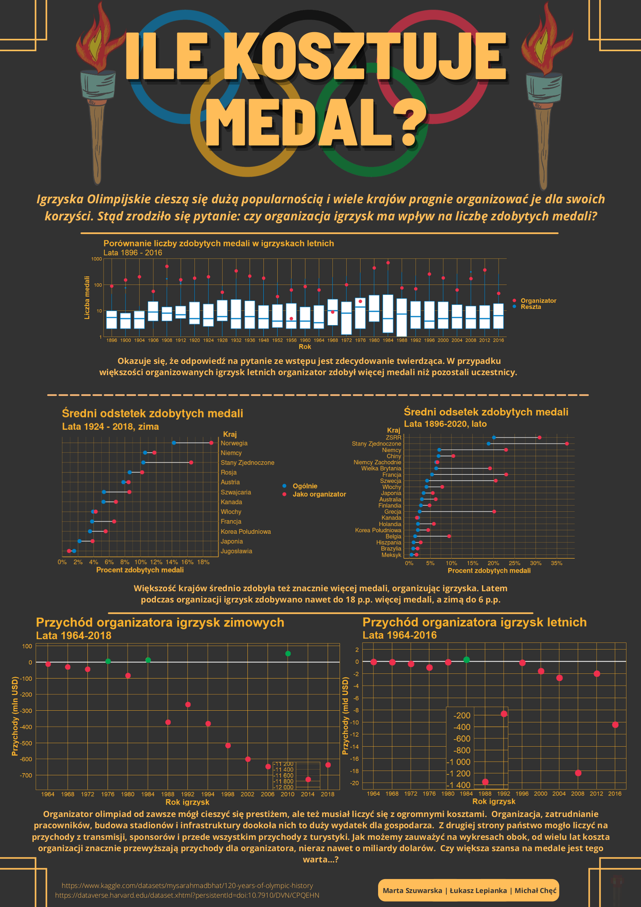
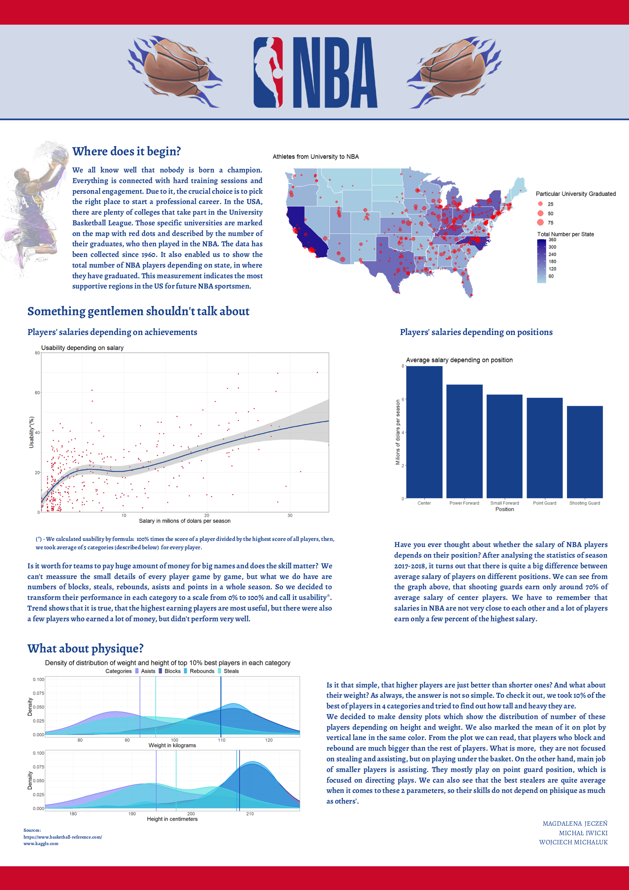
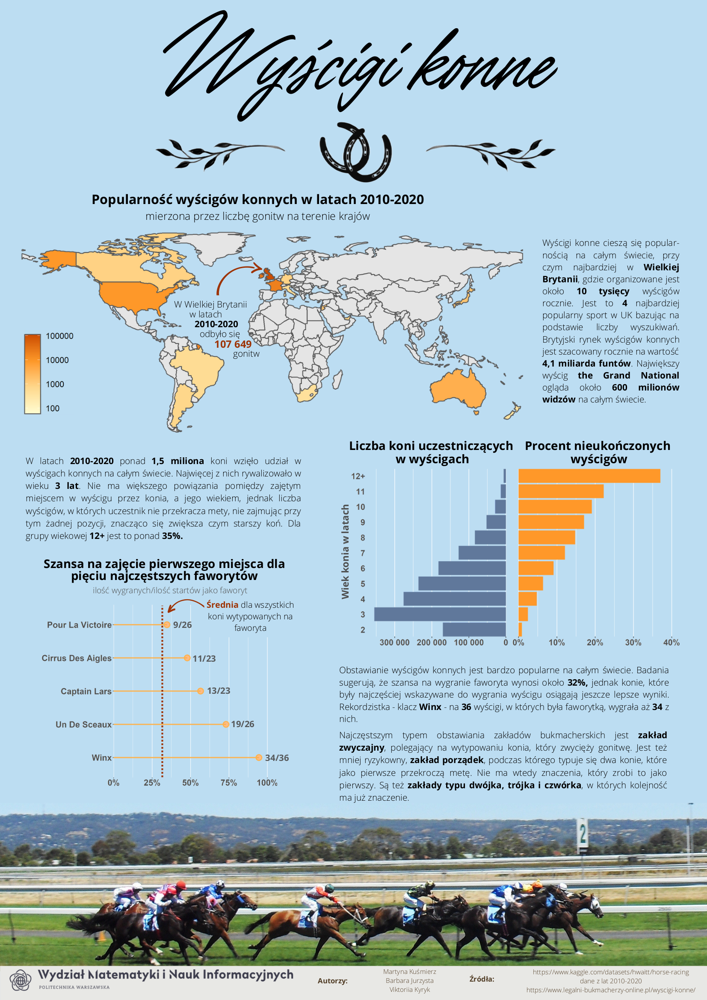
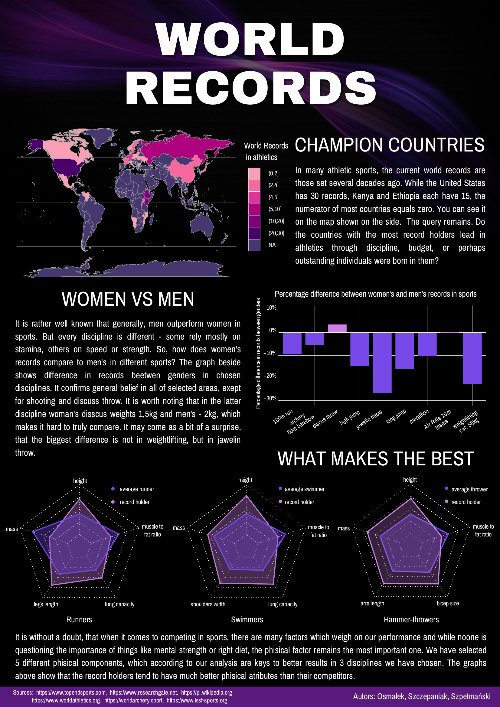
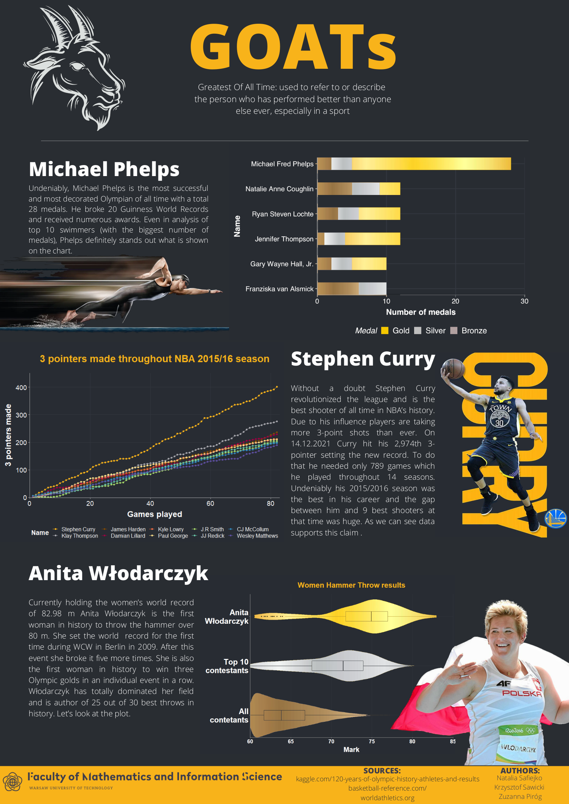
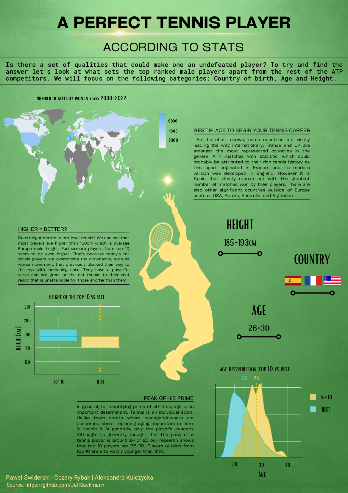
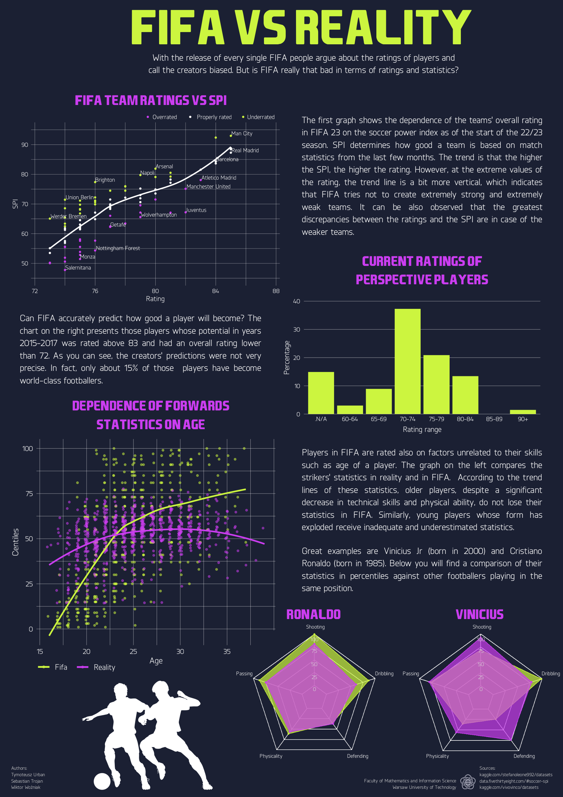

Baraniak Hubert, Charuza Alicja, Ciężki Jakub

             
Binda Michał, Grabarski Łukasz, Grabias Wojciech

Andryszak Mateusz, Borkowski Maciej, Wiktorzak Mateusz

             
Chęć Michał, Lepianka Łukasz, Szuwarska Marta

               
Geneja Michał, Pyzowski Rafał, Seliga Jakub

            
Grinchik Gleb, Matejczuk Michał, Warno Felicja

          
Grzywaczewski Jakub, Koniecko Wiktoria, Lange Jakub

              
Iwicki Michał, Jeczeń Magdalena, Michaluk Wojciech

              
Jurzysta Barbara, Kuśmierz Martyna, Kyryk Viktoriia

             
Kapich Aleks, Kosakowski Piotr, Wnęk Kacper

               
Kisiel Kamil, Kosz Krzysztof, Kubita Mateusz

                  
Kurdek Jeremi, Wiewiór Karol

Kwieciński Tymoteusz, Nizwantowski Mateusz, Wierzchowski Wiktor

     
Legczylin Michaił, Mączka Karolina, Mróz Mikołaj

Osmałek Agata, Szczepaniak Franciszek, Szpetmański Maciej

             
Rymarski Jakub, Sawicki Jakub, Zaręba Adrian

              
Piróg Zuzanna, Safiejko Natalia, Sawicki Krzysztof

Kulczycka Aleksandra, Rybak Cezary, Świderski Paweł
  

Trojan Sebastian, Urban Tymoteusz, Woźniak Wiktor

# P1: Sport
Pierwszy projekt poświęcony jest eksploracji danych dotyczących sportu. Jego celem jest przygotowanie plakatu w formacie A2 (+ .pdf), który przedstawi graficznie ciekawe informacje.

Wykresy mogą być wykonane w dowolnym narzędziu i złożone w plakat z użyciem dowolnej techniki. Podczas *Wykładu 8 (30-11-2022)* zespoły przedstawiają krótkie prezentacje swojej pracy.

Plakat powinien składać się ze zbioru przynajmniej trzech spójnych tematycznie wykresów oraz komentarzy/opisów do wykresów. Projekt wykonuje się w zespole 3 osobowym. Kody źródłowe wykresów i plakat w postaci elektronicznej należy umieścić na GitHubie.

## Zajęcia projektowe

Zajęcia projektowe to głównie wspólne dyskusje, praca w grupie, prezentacje kolejnych etapów, konsultacje.

<table style="undefined;table-layout: fixed; width: 526px">
<colgroup>
<col style="width: 59.116667px">
<col style="width: 82.116667px">
<col style="width: 331.116667px">
<col style="width: 54.116667px">
</colgroup>
<thead>
  <tr>
    <th>Tydzień</th>
    <th>Data</th>
    <th>Zakres</th>
    <th>Punkty</th>
  </tr>
</thead>
<tbody>
  <tr>
    <td>1</td>
    <td>05-10-2022</td>
    <td>Wprowadzenie do projektu, podział na zespoły.</td>
    <td></td>
  </tr>
  <tr>
    <td>2</td>
    <td>12-10-2022</td>
    <td>Praca w zespołach, burza mózgów, określenie tematyki plakatu.</td>
    <td>1</td>
  </tr>
  <tr>
    <td>3</td>
    <td>19-10-2022</td>
    <td>Na zajęcia należy przygotować pomysły jakie wizualizacje chcemy wykonać bazując na znalezionych danych.</td>
    <td>1</td>
  </tr>
  <tr>
    <td>4</td>
    <td>26-10-2022</td>
    <td>Na zajęciach zespoły prezentują swoje pierwsze wizualizacje.</td>
    <td>1</td>
  </tr>
  <tr>
    <td>5</td>
    <td>02-11-2022</td>
    <td>Na zajęciach zespoły prezentują swoje zaawansowane wizualizacje.</td>
    <td>1</td>
  </tr>
  <tr>
    <td>6</td>
    <td>16-11-2022</td>
    <td>Na zajęciach zespoły prezentują prototyp plakatu.</td>
    <td>1</td>
  </tr>
  <tr>
    <td>7</td>
    <td>23-11-2022</td>
    <td>Konsultacje.</td>
    <td></td>
  </tr>
</tbody>
</table>

## Ocena

Za projekt można otrzymać od 0 do 25 punktów, z czego:

-   do 1p uzyskuje się za przedstawienie postępu prac w danym tygodniu (5x),
-   do 5p uzyskuje się za przygotowanie poprawnych wykresów (trzy lub więcej),
-   do 5p uzyskuje się, jeżeli przygotowane wykresy mają wszystkie niezbędne elementy do trafnego odczytania danych (tytuł, podtytuł, adnotacje na osiach, legenda, jednostki, opis jak czytać wykres),
-   do 5p uzyskuje się za znalezienie ciekawych danych, tematów mniej popularnych w mediach, ale interesujących,
-   do 5p uzyskuje się za estetykę, spójność i pomysłowość aranżacji wykresów oraz ich opisów w jedną całość, umieszczenie informacji (tytuł, autorzy, źródło danych).

## Przykłady danych

-   dane o tenisie (mecze, pojedyncze punkty):
    -   kobiecy - [WTA](https://github.com/JeffSackmann/tennis_wta)
    -   męski - [ATP](https://github.com/JeffSackmann/tennis_atp)
    -   [inne repozytoria Jeff Sackmanna](https://github.com/JeffSackmann)
-   dane o piłce nożnej (mecze, drużyny, pojedynczy piłkarze):
    -   [https://understat.com](https://understat.com) - można je pobrać przy pomocy R-owego pakietu `worldfootballR` ([pakiet](https://github.com/JaseZiv/worldfootballR), [winietka](https://jaseziv.github.io/worldfootballR/articles/extract-understat-data.html))
-   dane o Formule 1 (wyścigi, ich wyniki, kierowcy, konstruktorzy):
    -   [od sezonu 1950](https://www.kaggle.com/datasets/rohanrao/formula-1-world-championship-1950-2020?select=constructor_results.csv)
    -   [od sezonu 2019](https://github.com/toUpperCase78/formula1-datasets), ale prostszy i z ratingami z gry
-   dane o skokach narciarskich (rezultaty, statystyki):
    -   [https://github.com/wrotki8778/Ski_jumping_data_center](https://github.com/wrotki8778/Ski_jumping_data_center)
-   dane o NBA (mecze, drużyny, pojedynczy koszykarze)
    -   [bardzo duża baza danych SQLite](https://www.kaggle.com/datasets/wyattowalsh/basketball)
    -   można pobrać podzbiór danych bezpośrednio przy użyciu pakietu `nba_api` ([pakiet](https://github.com/swar/nba_api), [notatniki](https://github.com/swar/nba_api/tree/master/docs/examples))
-   dane o Igrzyskach Olimpijskich w Tokio (wydarzenia, sportowcy, areny, rezultaty, medale):
    -   [https://www.kaggle.com/datasets/llui85/tokyo-2021-olympics-complete-grouped-by-type](https://www.kaggle.com/datasets/llui85/tokyo-2021-olympics-complete-grouped-by-type)
-   dane dostępne na Kaggle'u:
    -   [wyniki dla zapytania 'sport'](https://www.kaggle.com/datasets?search=sport)
-   dane e-sportowe:
    -   DOTA 2: [https://www.opendota.com/explorer?minDate=2022-07-30T10%3A54%3A40.552Z](https://www.opendota.com/explorer?minDate=2022-07-30T10%3A54%3A40.552Z) (API do wygenerowania csvki na podstawie dużej liczby gier)
    -   League of Legends: [https://towardsdatascience.com/how-to-use-riot-api-with-python-b93be82dbbd6](https://towardsdatascience.com/how-to-use-riot-api-with-python-b93be82dbbd6) (API)
    -   CS:GO: [https://sportsdata.io/developers/data-dictionary/csgo](https://sportsdata.io/developers/data-dictionary/csgo) (API) / [https://www.kaggle.com/datasets/gabrieltardochi/counter-strike-global-offensive-matches](https://www.kaggle.com/datasets/gabrieltardochi/counter-strike-global-offensive-matches) 

**Uwagi**

-   Duża część danych na Kaggle'u to bardzo proste i małe zbiorki, z których być trudno będzie wyciągnąć coś ciekawego. Na pewno warto poświęcić trochę czasu na eksplorację większych zbiorów (lub też poszukać innych) i wybrać z nich pewien ciekawy do zwizualizowania podzbiór.
-   Niektóre zbiory danych nie są w plikach `.csv`. W przypadku problemów z odczytaniem danych warto zwrócić uwagę, czy na Kaggle'u lub w dokumentacji odpowiednich pakietów nie ma notatników/winietek, które mogą posłużyć za pomoc.

## Oddanie projektu

Czas na wykonanie projektu jest do **29-11-2022** - do tego dnia (włącznie) będą przyjmowane Pull Requests na GitHub.

W PR o nazwie `[projekt1] Nazwisko1_Nazwisko2_Nazwisko3` należy zamieścić folder o nazwie `nazwisko1_nazwisko2_nazwisko3` zawierający:

-   plakat w formacie .pdf o nazwie `nazwisko1_nazwisko2_nazwisko3`,
-   wszystkie kody służące do odtworzenia wykresów (na ile to możliwe) w podfolderze `kody`.

PR robi jedna osoba z zespołu. Folder należy umieścić w [../projects/project1](https://github.com/MI2-Education/2023Z-DataVisualizationTechniques/tree/main/projects/project1).

Jeżeli zajęcia będą odbywały się w trybie stacjonarnym, należy wydrukować plakat i przynieść go na Wykład **8**. W trybie zdalnym należy nagrać prezentację opisującą pracę i załączyć ją w PR na GitHub (można nagrać prezentację w trybie stacjonarnym).

Uwagi:

-   na plakacie powinien znaleźć się podpis identyfikujący autorów,
-   można też zrobić upload nagrania na google drive i udostępnić mailem,
-   warto wysłać nagranie wcześniej, żeby była szansa na sprawdzenie czy dobrze się odtwarza.

## Materiały

Przykłady narzędzi do tworzenia plakatów:

-   PowerPoint
-   [https://www.canva.com/](https://www.canva.com/) (Pro with [https://education.github.com/pack](https://education.github.com/pack))
-   Inkscape

Plakaty z poprzednich lat:

-   [Posters that change the perspective on climate and the environment](https://medium.com/responsibleml/posters-that-change-the-perspective-on-climate-and-the-environment-c3682c0f6c39)
-   [poster::make([movie | book | series])](https://medium.com/responsibleml/poster-make-movie-book-series-3ac2c8a01180)
-   [COVID-19 Data Visualization](https://medium.com/responsibleml/covid-19-data-visualization-bc0732c19d46)
